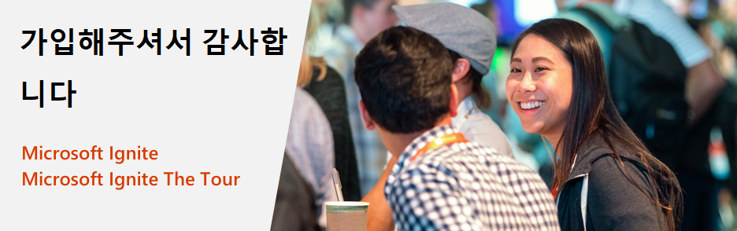

# Microsoft Ignite 및 Microsoft Ignite The Tour: 무료 인증 시험 제공

Microsoft Ignite 2019 또는 Microsoft Ignite The Tour 2019-2020 이벤트에 참석해 주셔서 감사합니다. 모든 참석자에게 특정 예외*에 따라 계속해서 기술을 익히고 직원들와 동료들에게 자신의 기술 전문 지식을 입증하는 데 도움이 되는 무료 인증 시험이 제공됩니다.

## 제안 세부 사항

Microsoft Ignite 2019 또는 Microsoft Ignite The Tour 2019-2020 이벤트에 참가한 경우 1회의 Microsoft 기본, 역할 기반 또는 전문 인증 시험을 무료로 받을 수 있습니다. 무료 시험 제안은 참가한 이벤트가 시작될 때부터 시작부터 상환 가능하며, 이벤트의 마지막 날 이후 180일 동안 유효합니다. 해당 기간 내에 시험을 예약하지 않으면 제안을 이행할 수 없습니다.  

##  무료 시험 청부 방법

본 시험은 디지털 제안이므로 온라인 시험 일정을 예약하는 경우, 이벤트 등록에 사용한 것과 동일한 소셜 계정을 사용하여 이벤트 참석 여부를 확인해야 합니다(아래 7단계 참조). 그룹으로 등록한 경우 이벤트 등록 프로필을 완성했는지 확인하시기 바랍니다. MS Ignite 2019 참석자는 [https://register.ignite.microsoft.com/](https://register.ignite.microsoft.com/); 로 이동하십시오, The Tour 참석자는 [https://register.msignite-the-tour.microsoft.com/](https://register.msignite-the-tour.microsoft.com/)도시명, 예: [https://register.msignite-the-tour.microsoft.com/london](https://register.msignite-the-tour.microsoft.com/london) 으로 이동하여 이벤트 프로필을 완성하십시오.

단계별 스크린샷은 [여기를 참조하십시오](https://query.prod.cms.rt.microsoft.com/cms/api/am/binary/RE4i3R4).

***무료 인증 시험 등록 방법:***

1. 아래의 목록에서 자격시험을 선택합니다.
2. 원하는 시험 정보 페이지에 액세스한 후 “시험 예약” 버튼을 클릭하여 온라인 등록 과정을 시작합니다.
3. Microsoft 인증 프로필과 연결된 Microsoft 계정에 로그인합니다.  Microsoft 인증 프로필이 없는 경우 프로필을 생성해야 합니다.
4. Microsoft 인증 프로필에 로그인한 후 인증 프로필의 정보가 정확한지 확인합니다.
5. 인증 프로필 페이지 하단에 있는 “저장하고 계속” 버튼을 클릭하여 '시험 할인' 페이지로 이동합니다.
6. '시험 할인' 페이지에서 참석했던 이벤트를 선택하고 “계정 확인” 버튼을 클릭합니다.
7. 계정을 확인할 때는 이벤트 등록에 사용한 것과 동일한 소셜 계정을 사용하여야 합니다(참고: 이벤트 등록에 Microsoft 계정을 사용한 경우, 동일한 Microsoft 계정으로 인증 프로필에 로그인하여 시험 일정을 예약해야 합니다. 인증 프로필이 두 개인 경우, [Microsoft 인증 지원 포럼](https://trainingsupport.microsoft.com/ko-kr/mcp/forum?sort=LastReplyDate&dir=Desc&tab=All&status=all&mod=&modAge=&advFil=&postedAfter=&postedBefore=&threadType=All&isFilterExpanded=false&page=1) 에 문의하여 인증 시험을 완료한 후 프로필을 통합해야 합니다.)
8. 다음 화면의 단계에 따라 시험 일정을 예약하는 데 필요한 정보를 제공합니다.
9. 체크 아웃 시 총 금액이 $0.00인지 확인하고 주문서를 제출합니다.  참고: ‘내 주문’ 페이지의 하단에 다음과 같은 할인이 표시됩니다.  ***Microsoft Ignite 2019-2020 100% 할인***.  시험 예약 흐름의 이전 페이지에 전체 가격이 표시됩니다.

***인증 지원:***

시험 예약에 문제가 있는 경우 [Microsoft 인증 지원 포럼](https://trainingsupport.microsoft.com/ko-kr/mcp/forum?sort=LastReplyDate&dir=Desc&tab=All&status=all&mod=&modAge=&advFil=&postedAfter=&postedBefore=&threadType=All&isFilterExpanded=false&page=1) 에서 도움을 받으십시오. 포럼의 조정자는 업무일 하루만에 응답할 것입니다.

##  이 제안에 대한 자격 시험

이 제안에는 모든 Microsoft 기본, 역할 기반 및 전문 인증 시험이 포함됩니다. 아래에 자격 있는 시험을 나열했습니다.

| 제품별 | 시험 |
| --- | --- |
| Azure | [AI-100: Designing and Implementing an Azure AI Solution](/learn/certifications/exams/ai-100) [AZ-103: Microsoft Azure Administrator](/learn/certifications/exams/az-103) [AZ-120: Planning and Administering Microsoft Azure for SAP Workloads](/learn/certifications/exams/az-120) [AZ-203: Developing Solutions for Microsoft Azure](/learn/certifications/exams/az-203) [AZ-300: Microsoft Azure Architect Technologies](/learn/certifications/exams/az-300) [AZ-301: Microsoft Azure Architect Design](/learn/certifications/exams/az-301) [AZ-400: Microsoft Azure DevOps Solutions](/learn/certifications/exams/az-400) [AZ-500: Microsoft Azure Security Technologies](/learn/certifications/exams/az-500) [AZ-900: Microsoft Azure Fundamentals](/learn/certifications/exams/az-900) [DP-100: Designing and Implementing a Data Science Solution on Azure](/learn/certifications/exams/dp-100) [DP-200: Implementing an Azure Data Solution](/learn/certifications/exams/dp-200) [DP-201: Designing an Azure Data Solution](/learn/certifications/exams/dp-201) |
| Dynamics 365 and Power Platform | [MB-200: Microsoft Power Platform + Dynamics 365 Core](/learn/certifications/exams/mb-200) [MB-210: Microsoft Dynamics 365 Sales](/learn/certifications/exams/mb-210) [MB-220: Microsoft Dynamics 365 Marketing](/learn/certifications/exams/mb-220) [MB-230: Microsoft Dynamics 365 Customer Service](/learn/certifications/exams/mb-230) [MB-240: Microsoft Dynamics 365 Field Service](/learn/certifications/exams/mb-240) [MB-300: Microsoft Dynamics 365: Core Finance and Operations](/learn/certifications/exams/mb-300) [MB-310: Microsoft Dynamics 365 Finance](/learn/certifications/exams/mb-310) [MB-320: Microsoft Dynamics 365 Supply Chain Management, Manufacturing](/learn/certifications/exams/mb-320) [MB-330: Microsoft Dynamics 365 Supply Chain Management](/learn/certifications/exams/mb-330) [MB-400: Microsoft PowerApps + Dynamics 365 Developer](/learn/certifications/exams/mb-400) [MB-500: Microsoft Dynamics 365: Finance and Operations Apps Developer](/learn/certifications/exams/mb-500) [MB-600: Microsoft Power Platform + Dynamics 365 Solution Architect (시험은 2019년 12월 31일 이후에 베타 버전으로 사용할 수 있습니다)](/learn/certifications/exams/mb-600) [MB-700: Microsoft Dynamics 365: Finance and Operations Apps Solution Architect (시험은 2019년 12월 31일 이후에 베타 버전으로 사용할 수 있습니다)](/learn/certifications/exams/mb-700) [MB-900: Microsoft Dynamics 365 Fundamentals](/learn/certifications/exams/mb-900)  [PL-900: Microsoft Power Platform Fundamentals](/learn/certifications/exams/pl-900)|
| Microsoft 365 | [MD-100: Windows 10](/learn/certifications/exams/md-100) [MD-101: Managing Modern Desktops](/learn/certifications/exams/md-101) [MS-100: Microsoft 365 Identity and Services](/learn/certifications/exams/ms-100) [MS-101: Microsoft 365 Mobility and Security](/learn/certifications/exams/ms-101) [MS-200: Planning and Configuring a Messaging Platform](/learn/certifications/exams/ms-200) [MS-201: Implementing a Hybrid and Secure Messaging Platform](/learn/certifications/exams/ms-201) [MS-300: Deploying Microsoft 365 Teamwork](/learn/certifications/exams/ms-300) [MS-301: Deploying SharePoint Server Hybrid](/learn/certifications/exams/ms-301) [MS-500: Microsoft 365 Security Administration](/learn/certifications/exams/ms-500) [MS-600: Building Applications and Solutions with Microsoft 365 Core Services](/learn/certifications/exams/ms-600) [MS-700: Managing Microsoft Teams](/learn/certifications/exams/ms-700) [MS-900: Microsoft 365 Fundamentals](/learn/certifications/exams/ms-900) |

## 계약 조건

- 이 시험 제안은 Microsoft Ignite 2019 또는 Microsoft Ignite The Tour 2019-2020 이벤트에 참가한 적 있는 개인에게 제공됩니다.
- 이 시험 제안은 공인 Pearson Vue 테스트 센터 또는 Pearson Vue 온라인 감독 사이트를 통해 제공되는 (1)개의 Microsoft 인증 시험을 치르는 데 사용할 수 있습니다.
- 이 시험 제안은 시험마다 다르며 Microsoft 시험 선택에만 사용할 수 있습니다.
- 이 시험 제안은 이 시험 제안을 받은 첫날부터 시작하여 해당 이벤트의 마지막 날로부터 180일까지 사용할 수 있습니다.
- 본 시험 제안은 제안 만료일 전에 (1)회 시험에만 응시할 수 있는 자격을 부여합니다.
- 이 시험 제안의 만료일은 어떠한 경우에도 연장할 수 없습니다.
- 본 시험 제안은 1) 공무원, 또는 2) 홍콩, 스위스, 이스라엘, 독일, 러시아, 스웨덴 거주자에 해당하는 경우에는 유효하지 않으며 사용에 제한이 있을 수 있습니다. *이 제안은 Microsoft 정책 및 현지 법률에 따라 허용 가능한 한도를 초과 **하므로** 정부 관계자 또는 언급된 국가 거주자에게는 제공되지 않습니다.
- 이 시험 제안은 한 번만 제공될 수 있습니다.
- 이 시험 제안은 상환되거나 현금, 신용 또는 환불로 교환할 수 없습니다.
- 이 시험 제안은 양도할 수 없으며 변경, 수정 또는 양도할 경우 무효로 됩니다.
- 본 시험 제안은 공식 Microsoft Ignite 2019 또는 Microsoft Ignite The Tour 2019-2020 이벤트에 등록하여 참가한 개인에게만 제공됩니다.

자세한 내용은 [Microsoft 이용 약관](https://www.microsoft.com/ko-kr/legal/intellectualproperty/copyright/default.aspx?SilentAuth=1) 전문을 참조하십시오.

## 외부 FAQ - MS Ignite 및 The Tour 무료 시험 제안

### 제안에 관한 정보

**큐: 이 제안으로 몇 개의 시험을 무료로 예약할 수 있나요?**

**앤:** 이 제안으로 자격증 시험 하나를 무료로 신청 가능합니다.

**큐: 이 제안으로 치를 수 있는 인증 시험은 무엇인가요?**

**앤:** 이 제안에는 모든 Microsoft 기본, 역할 기반 및 전문 인증 시험이 포함됩니다. 인증 시험 목록은 다음의 제안 정보 페이지의 “이 제안으로 치를 수 있는 시험” 섹션을 참조하십시오. [https://docs.microsoft.com/ko-kr/learn/certifications/microsoft-ignite-free-certification-exam-offer#eligible-exams-for-this-offer](https://docs.microsoft.com/ko-kr/learn/certifications/microsoft-ignite-free-certification-exam-offer#eligible-exams-for-this-offer).

**큐: 자격이 되는 이벤트에 등록했지만 직접 참가하지는 않았습니다. 그래도 제안이 유효한가요?**

**앤:** 아니오, 이 제안은 Microsoft Ignite 2019 또는 Microsofy Ignite The Tour 2019-2020 행사에 직접 참석한 사람에게만 유효합니다.

**큐: 홍콩, 스위스, 이스라엘, 독일, 러시아, 스웨덴 거주자는 왜 자격 대상이 아닌가요?**

**앤:** 본 국가 거주자는 Microsoft의 증정 정책 및 현지 법으로 인해 제안을 제공할 수 없습니다. 각국은 어느 기업이든 주민에게 증정하는 것을 제한하는 구체적인 법안을 가지고 있으며, 당사의 인증 시험 가치는 제한을 초과하므로 Microsoft는 이들 국가의 거주자에게 무료 시험을 제공할 수 없습니다.

### 무료 시험 예약

**큐: 이미 참석했거나 참석할 예정인 이벤트 기간 동안에만 이 제안으로 무료 시험을 예약할 수 있나요?**

**앤:** 아니오, 참석하신 이벤트 기간 내에 이 제안으로 무료 시험을 예약하지 않아도 됩니다. 이벤트 중이나 이벤트 종료 이후에 시험 예약이 가능합니다. 무료 시험을 치를 수 있는 제안은 행사가 끝난 다음 날부터 180일 이후에 만료됩니다.

**큐: 이벤트가 종료된 후 180일 이내에 시험을 치러야 하나요?**

**앤:** 네, 이벤트가 끝난 후 180일 이내에 시험을 치러야 합니다.

**큐: 이 제안으로 무료 시험을 예약하는 방법이 어떻게 되나요?**

**앤:** 무료 시험을 예약하는 방법은 [https://docs.microsoft.com/ko-kr/learn/certifications/microsoft-ignite-free-certification-exam-offer#how-to-claim-your-free-exam](https://docs.microsoft.com/ko-kr/learn/certifications/microsoft-ignite-free-certification-exam-offer#how-to-claim-your-free-exam) 을 참조하십시오.

**큐: 시험 할인 자격을 확인하는 도중 공무원이 아닌데도 공무원이라는 이유로 자격이 없다고 뜹니다. 어떻게 해야 하죠?**

**앤:** 신원을 공무원으로 잘못 인식하는 경우, 이벤트 등록 프로필에서 정부 입력란을 업데이트하고 이벤트가 종료된 후 자격 여부를 확인할 수 있습니다. [Microsoft 인증 지원 포럼](https://trainingsupport.microsoft.com/mcp/forum?sort=LastReplyDate&dir=Desc&tab=All&status=all&mod=&modAge=&advFil=&postedAfter=&postedBefore=&threadType=All&isFilterExpanded=false&page=1) ([https://aka.ms/CertificationSupport](https://aka.ms/CertificationSupport)) 에 도움을 요청할 수도 있습니다.

**큐: 무료 시험 예약에 문제가 있습니다. 어디서 도움을 받을 수 있나요?**

**앤:** [Microsoft 인증 지원 포럼](https://trainingsupport.microsoft.com/mcp/forum?sort=LastReplyDate&dir=Desc&tab=All&status=all&mod=&modAge=&advFil=&postedAfter=&postedBefore=&threadType=All&isFilterExpanded=false&page=1) ([https://aka.ms/CertificationSupport](https://aka.ms/CertificationSupport)) 에서 도움을 받을 수 있습니다. 조정자가 영업일 하루 만에 연락을 취할 겁니다.

**큐: 예약한 시험을 직접 치르거나 온라인으로 치르는 것을 선택할 수 있나요?**

**앤:** 네, 예약한 시험은 지역 Pearson Vue 시험 센터에서 직접 치르거나 온라인 감독(OP)을 통해 치를 수 있습니다. 온라인 시험에 대해 자세히 알아보려면 다음을 참조하세요
[https://www.microsoft.com/ko-kr/learning/online-exams.aspx](https://www.microsoft.com/ko-kr/learning/online-exams.aspx)

### 취소 및 일정 변경 정책

**큐: 필요한 경우 이 제안으로 예약한 시험 날짜를 변경할 수 있나요?**

**앤:** 네, 예약한 시험 날짜를 변경할 수 있지만 이벤트 종료 후 180일 이내에만 가능합니다. 시험 일정은 예약일 기준 최소 6일 전에 변경해야 수수료가 부과되지 않습니다. [일정 변경 정책 참조](https://microsoft.sharepoint.com/teams/MarketingTeam7/Shared%20Documents/FY20%20Ignite%20Flagship%20Event/Free%20Exam%20Voucher%20Offer%20and%20Nurture%20Stream/MS%20Ignite_FreeExam_Customer%20Journey.pptx).

**큐: 약속을 변경하거나 예약을 취소할 경우 수수료가 부과되나요?**

**앤:** 예약일 기준 최소 6일 전에 시험 약속을 변경하거나 취소하면 수수료가 부과되지 않습니다. 예약일 기준 영업일 5일 내에 일정을 변경하는 경우 변경 수수료를 지불해야 합니다. 예약일 기준 이틀 전에는 예약을 변경하거나 취소할 수 없을 수 있습니다. 시험을 치르지 않으면 제공된 무료 시험 자격이 박탈됩니다. 자세한 내용은 [취소 및 일정 변경 정책](https://docs.microsoft.com/ko-kr/learn/certifications/certification-exam-policies#cancellation-and-reschedule-policy) 을 참조하십시오.

**큐: 약속한 시험을 치르지 않고 일정을 변경하거나 취소하지 않은 경우에는 어떻게 되나요?**

**앤:** 예약일 기준 24시간 이전에 일정을 변경하거나 취소하지 않고 예약한 시험에 출석하지 못한 경우, 무료 시험 자격이 박탈됩니다. 자세한 내용은 [취소 및 일정 변경 정책](https://docs.microsoft.com/ko-kr/learn/certifications/certification-exam-policies#cancellation-and-reschedule-policy) 을 참조하십시오.

### 재응시 정책

**큐: 무료 인증 시험 제안을 사용하여 치른 첫 번째 시험에 낙제한 경우 무료로 시험에 재응시할 수 있나요?**

**앤:** 아니오, 이 제안은 한 번의 시험에만 유효하며 재시험은 별도로 예약해야 합니다. 인증 시험 재응시에 대한 자세한 내용은 [시험 재응시 정책](https://www.microsoft.com/ko-kr/learning/certification-exam-policies.aspx#policies-1) 을 참조하십시오.